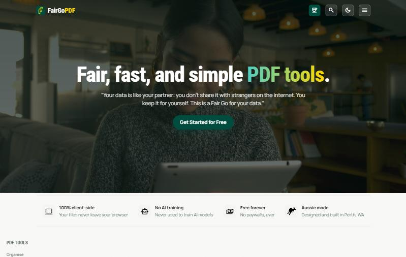
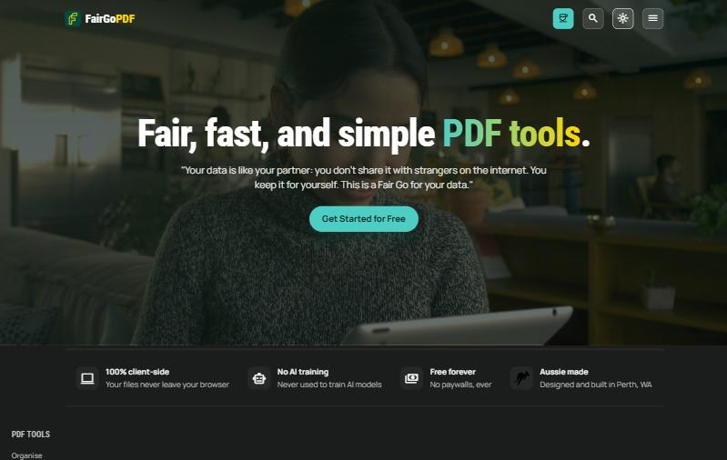
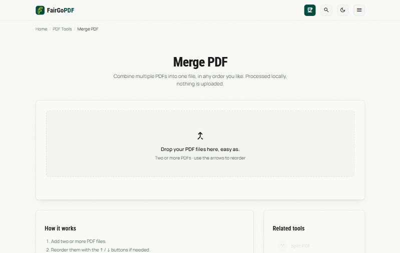
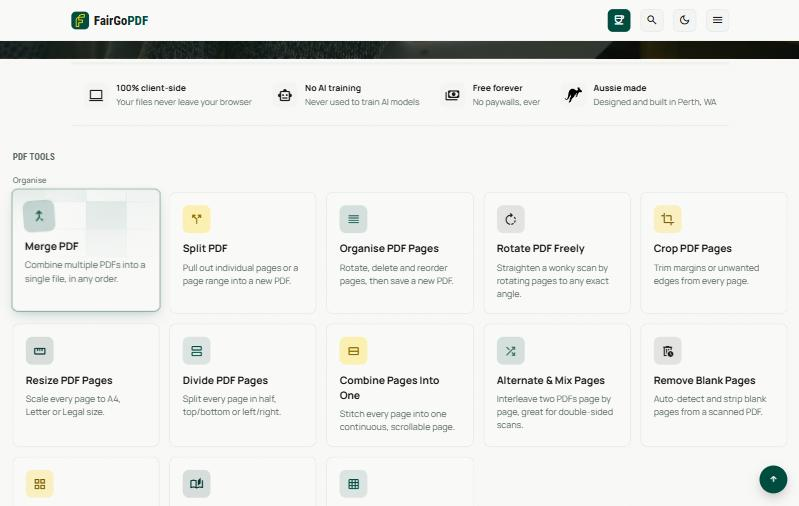

# Fair Go PDF

No worries, PDF tools done right. Free, no-signup, privacy-first browser tools for common image and
PDF tasks — compress, convert, resize, merge, split, and more.

**Your files never leave your browser.** Every tool runs entirely as client-side JavaScript. There
is no backend, no upload, and no server that ever sees your files — you could disconnect from the
internet after the page loads and every tool would still work. No account, no email gate, no
watermarked output.

[**fairgopdf.au →**](https://fairgopdf.au/)



<table>
<tr>
<td width="50%">

**Dark mode, same privacy**


</td>
<td width="50%">

**One of 76 tools, each its own page**


</td>
</tr>
</table>

## Tools (v1)

76 tools across three categories — 11 image, 52 PDF, 13 utilities.



### Image tools
| Tool | URL | What it does |
|---|---|---|
| Compress Image | `/compress-image/` | Reduce JPEG/PNG/WebP file size with a quality slider |
| Convert Image Format | `/convert-image/` | Convert between PNG, JPG, WebP, GIF, BMP and SVG |
| HEIC to JPG | `/heic-to-jpg/` | Convert iPhone HEIC/HEIF photos to JPG |
| Resize Image | `/resize-image/` | Resize by exact pixel dimensions or by percentage |
| Crop & Rotate Image | `/crop-rotate-image/` | Rotate, flip, and drag-to-crop |
| Add Border to Image | `/add-border-to-image/` | Add a solid colour frame around one or more images |
| Image Colour Filters | `/image-colour-filters/` | Greyscale, sepia, brightness, contrast and saturation |
| Round Corners / Circle Crop | `/round-corners-image/` | Round an image's corners or crop it to a circle |
| Watermark Image | `/watermark-image/` | Stamp custom text across one or more images |
| Social Media Cropper | `/social-media-cropper/` | Crop to exact Instagram/X/YouTube/LinkedIn/Facebook sizes |
| Collage Studio | `/collage-studio/` | Drag, resize and rotate photos anywhere on a board, no fixed grid |

### PDF tools
| Tool | URL | What it does |
|---|---|---|
| Merge PDF | `/merge-pdf/` | Combine multiple PDFs into one, in any order |
| Split PDF | `/split-pdf/` | Extract selected pages or a page range |
| Compress PDF | `/compress-pdf/` | Reduce PDF file size (quick clean or strong/rasterised) |
| Images to PDF | `/images-to-pdf/` | Combine JPG/PNG images into a single PDF |
| HEIC to PDF | `/heic-to-pdf/` | Turn one or more iPhone HEIC/HEIF photos into a single PDF |
| PDF to Images | `/pdf-to-images/` | Export every page as a PNG, JPG or WebP |
| Organise PDF Pages | `/organise-pdf/` | Rotate, delete, reorder, add blank pages, or reverse order |
| Extract PDF Text | `/extract-pdf-text/` | Pull all text out of a PDF to copy or download as .txt |
| OCR PDF | `/ocr-pdf/` | Make a scanned PDF searchable and copyable with on-device text recognition (self-hosted PaddleOCR engine, ~33 MB on first use) |
| Tag PDF | `/tag-pdf/` | Add accessibility tags, bookmarks, language and a title to a mostly-text PDF, with a review screen for headings and image descriptions |
| Edit PDF Metadata | `/pdf-metadata/` | View, change, or clear title, author, subject and keywords |
| Add Page Numbers | `/add-page-numbers/` | Stamp page numbers in any position/format, with zero-padding for Bates-style numbering |
| Watermark PDF | `/watermark-pdf/` | Add a custom text watermark across every page |
| Resize PDF Pages | `/resize-pdf-pages/` | Scale every page to A4, Letter or Legal size |
| Crop PDF Pages | `/crop-pdf/` | Trim margins or unwanted edges from every page |
| Compare PDFs | `/compare-pdfs/` | Diff the text of two PDF versions line by line |
| Fill PDF Form | `/fill-pdf-form/` | Fill text fields, checkboxes and dropdowns on a PDF form |
| Sign PDF | `/sign-pdf/` | Draw or type a signature and place it on any page |
| PDF Colour Filters | `/pdf-colour-filters/` | Greyscale, invert, or adjust brightness/contrast/saturation across every page |
| Text to PDF | `/text-to-pdf/` | Turn plain text into a paginated PDF |
| Flatten PDF | `/flatten-pdf/` | Turn fillable form fields into static, non-editable content |
| N-Up PDF | `/n-up-pdf/` | Combine 2, 4, 6 or 9 pages onto a single sheet |
| Alternate & Mix Pages | `/alternate-mix-pages/` | Interleave two PDFs page by page, for double-sided scan workflows |
| PDF Booklet Maker | `/pdf-booklet/` | Reorder pages into booklet (saddle-stitch) order for print, fold and staple |
| Add Stamps | `/add-stamps/` | Place a logo or image stamp on one page, a range, or every page |
| Repair PDF | `/repair-pdf/` | Attempt to fix a PDF that won't open by leniently re-parsing and rebuilding a clean copy |
| Extract Images | `/extract-pdf-images/` | Pull every embedded image out of a PDF and download as a ZIP |
| Header & Footer | `/pdf-header-footer/` | Add up to six independent left/centre/right text zones to every page's header and footer |
| Redact PDF | `/redact-pdf/` | Permanently black out sensitive content by flattening marked pages to an image, not just drawing a box over it |
| Protect PDF | `/protect-pdf/` | Add a password so only people who have it can open the file, with optional printing/copying/editing permissions |
| Unlock PDF | `/unlock-pdf/` | Remove a password from a PDF you already have the password for |
| PDF Editor | `/pdf-editor/` | Drag text and image boxes anywhere on any page, resize and style them |
| Add Links to PDF | `/add-links-to-pdf/` | Draw a clickable area on a page that opens a website or jumps to another page |
| PDF Form Builder | `/pdf-form-builder/` | Add fillable text fields, checkboxes, radio buttons and dropdowns as real AcroForm fields |
| Remove Blank Pages | `/remove-blank-pages/` | Auto-detect and strip blank pages from a scanned PDF |
| Rotate PDF Freely | `/rotate-pdf-freely/` | Straighten a wonky scan by rotating pages to any exact angle |
| Sanitise PDF | `/sanitise-pdf/` | Strip embedded scripts, auto-actions, attachments and metadata |
| Remove Annotations | `/remove-annotations/` | Strip comments, highlights and markup, links and forms stay intact |
| PDF Background Colour | `/pdf-background-colour/` | Add a solid colour behind every page of a PDF |
| Divide PDF Pages | `/divide-pdf-pages/` | Split every page in half, top/bottom or left/right |
| Posterise PDF | `/posterise-pdf/` | Blow up a page across multiple sheets for large-format printing |
| Combine Pages Into One | `/combine-pages-into-one/` | Stitch every page into one continuous, scrollable page |
| Markdown to PDF | `/markdown-to-pdf/` | Turn Markdown into a styled, paginated PDF |
| Word to PDF | `/word-to-pdf/` | Turn a Word (.docx) document into a PDF |
| CSV to PDF | `/csv-to-pdf/` | Turn a CSV file into a paginated PDF table |
| Excel to PDF | `/excel-to-pdf/` | Turn a spreadsheet into a paginated PDF table |
| RTF to PDF | `/rtf-to-pdf/` | Turn a Rich Text (.rtf) file into a PDF |
| EPUB to PDF | `/epub-to-pdf/` | Turn an EPUB ebook into a PDF, chapters in order |
| PDF to Word | `/pdf-to-word/` | Turn a PDF into an editable Word document |
| PDF Annotator | `/pdf-annotator/` | Highlight, freehand draw and add sticky notes |
| PDF Scanner | `/pdf-scanner/` | Turn a photo of a document into a straightened PDF |
| CBZ to PDF | `/cbz-to-pdf/` | Turn a CBZ comic book archive into a PDF |

### Utilities
| Tool | URL | What it does |
|---|---|---|
| Convert to Markdown | `/convert-to-markdown/` | Convert a PDF, Word (.docx) or HTML file to Markdown |
| AI Writing Checker | `/ai-writing-checker/` | Flag AI-sounding words, filler phrases and cliché patterns in any text |
| Password Generator | `/password-generator/` | Generate a strong random password, cryptographically secure, nothing stored or sent |
| QR Code Generator | `/qr-code-generator/` | Turn any text or URL into a QR code, download as PNG or SVG |
| UUID Generator | `/uuid-generator/` | Generate random v4 UUIDs, one or in bulk |
| Hash / Checksum Generator | `/hash-generator/` | Generate SHA-1/256/384/512 hashes of text or a file |
| JSON Formatter | `/json-formatter/` | Pretty-print, minify and validate JSON |
| Case Converter | `/case-converter/` | Convert text between UPPERCASE, lowercase, camelCase and more |
| Colour Picker & Converter | `/colour-picker/` | Pick a colour and convert between HEX, RGB and HSL live |
| Word & Character Counter | `/word-counter/` | Count words, characters, sentences and paragraphs, with reading time |
| Read Aloud | `/read-aloud/` | Have a PDF, Word doc, .txt file or pasted text read aloud, with live word highlighting |
| Handwriting Worksheets | `/handwriting-worksheets/` | Printable cursive or print handwriting practice sheets with traceable letters |
| Calendar Generator | `/calendar-generator/` | Printable 12-month calendar PDF for any year, mark birthdays and custom dates |

### Coming soon (v2 backlog)
- Cryptographically verified e-signatures
- PDF to Excel
- Convert PDF to PDF/A-3b (archival format) — confirmed feasible client-side via
  [Ghostscript compiled to WebAssembly](https://github.com/jsscheller/ghostscript-wasm) (real
  prior art: [Bentopdf](https://huggingface.co/spaces/AUXteam/Bentopdf) does exactly this),
  deliberately deferred: the WASM binary is ~16–25MB (lazy-loaded only for this tool, not
  site-wide), there's no client-side way to formally validate the output against the PDF/A-3b
  spec (same limitation most automated converters have), and Ghostscript is AGPL-licensed, which
  needs a real legal read before bundling it into an otherwise MIT-licensed site
- PDF/A structural spot-check tool — checks a PDF against the handful of PDF/A requirements that
  are actually verifiable with `pdf-lib` alone (tagged structure, `/OutputIntent`/ICC profile
  present, XMP metadata with the right `pdfaid:part`/`conformance`, no encryption or JavaScript),
  same honesty pattern as the existing Accessibility Checker: flags the structural basics, doesn't
  claim full ISO 19005 certification. Informed by [veraPDF](https://github.com/verapdf)'s openly
  licensed (CC BY 4.0) [validation profiles](https://github.com/veraPDF/veraPDF-validation-profiles)
  and [test corpus](https://github.com/veraPDF/veraPDF-corpus) as reference/test material, not their
  actual validation engine (Java/JVM-only, GPL-3.0, no client-side port exists). Doesn't depend on
  the PDF/A-3b conversion tool above or its AGPL question, since this needs no Ghostscript at all
- Import a file directly from Google Drive / OneDrive / Dropbox on a tool's dropzone — technically
  feasible without routing the file through a server (each provider's picker fetches the file bytes
  straight from the provider to the browser), but deliberately deferred: it needs loading each
  provider's own JS SDK live from their servers, which can't be self-hosted, a real expansion of the
  Content-Security-Policy's trusted domains, and an OAuth app registration (plus Google's app
  verification review) per provider. The bigger reason, though, is positioning, not engineering: an
  opt-in "Sign in with Google" button is the first thing on the page that visibly contradicts the
  "nothing talks to anyone except this site" promise the Privacy Policy and Terms & Conditions are
  built on, even though the file itself would never touch Fair Go PDF's own (non-existent) server

Some of these genuinely require server-side processing (format conversion beyond what browsers
support natively) and are out of scope for v1 on purpose; others are feasible
client-side but deliberately deferred as bigger scoped efforts. If you want to tackle one, see
[Contributing](CONTRIBUTING.md).

### Also considered: a downloadable desktop app
Packaging this site as an installable native app via [Tauri](https://tauri.app/) (Rust + the OS's
built-in webview, so a few MB rather than Electron's 100+ MB) is feasible since every tool is
already 100% client-side — the existing site could serve as the frontend almost unchanged, with
local fonts swapped in so it's genuinely offline from a fresh install, not just after one visit.
Deliberately not started yet: it needs a Rust toolchain that isn't part of this project anywhere
else, and a trustworthy (no "unknown publisher" warning) install needs paid code-signing on both
Windows and macOS. A free unsigned Windows build is the realistic first step whenever this gets
picked up.

### Other pages
- [Blog](/blog/) — articles on PDF/image know-how, Australian privacy law and industry-specific use cases
- [FAQ](/faq/) — common questions about privacy, cost, file limits and browser support
- [Support](/support/) — optional one-off or recurring support via Stripe. **The Stripe Payment Link
  URLs on this page are placeholders (`href="#"`)** — create real ones in your Stripe Dashboard
  (Payment Links → New, no backend required) and swap them into `support/index.html` before this
  page goes live.
- [Privacy Policy](/privacy-policy/) — what data is (and isn't) collected

## Tech stack

Plain HTML, CSS and vanilla JavaScript — **no build step, no framework, no bundler.** Each tool is
a static page that uses two well-maintained open-source libraries, self-hosted under
`assets/vendor/` (not loaded from a CDN — browsers block cross-origin `Worker` construction, which
`pdf.js` needs, and self-hosting also means these tools keep working even if a third-party CDN is
ever down):

- [`pdf-lib`](https://pdf-lib.js.org/) — creating/editing PDFs (merge, split, rotate, compress, images→PDF)
- [`@cantoo/pdf-lib`](https://github.com/cantoo-scribe/pdf-lib) — a `pdf-lib` fork with PDF encryption support, used only by Protect PDF and Unlock PDF (the original `pdf-lib` has no encryption support)
- [`pdf.js`](https://mozilla.github.io/pdf.js/) — rendering PDF pages to canvas (thumbnails, PDF→images)
- [`mammoth.js`](https://github.com/mwilliamson/mammoth.js) — converting Word (.docx) to HTML (Convert to Markdown)
- [`turndown`](https://github.com/mixmark-io/turndown) — converting HTML to Markdown (Convert to Markdown)
- [`qrcode-generator`](https://github.com/kazuhikoarase/qrcode-generator) — QR code encoding (QR Code Generator)
- [`SheetJS`](https://sheetjs.com/) — reading .xlsx/.xls/.ods spreadsheets (Excel to PDF)
- [`heic2any`](https://github.com/alexcorvi/heic2any) — decoding HEIC/HEIF photos to JPEG (HEIC to PDF, HEIC to JPG), bundles `libheif` (LGPL-3.0) compiled to WebAssembly
- [`fflate`](https://github.com/101arrowz/fflate) — ZIP packing and FlateDecode decompression (Extract Images from PDF)
- Native Canvas API — all image compression/conversion/resize/crop/rotate

This keeps the site trivially deployable to any static host, with nothing to compile and no
`node_modules` required to run it locally.

## Running locally

Because a couple of tools load ES modules and fetch worker scripts, open the site through a local
web server rather than double-clicking `index.html` (browsers restrict module loading from
`file://`). Any static file server works, for example:

```bash
npx serve .
# or
python -m http.server 8000
```

Then open the printed local URL (e.g. `http://localhost:3000` or `http://localhost:8000`).

## Project structure

```
/
├── index.html              # Homepage listing all tools
├── faq/index.html           # FAQ
├── privacy-policy/index.html # Privacy policy
├── 404.html
├── robots.txt
├── sitemap.xml
├── vercel.json              # Legacy URL redirects + response headers (see Deploying)
├── assets/
│   ├── style.css            # Shared styles (light + dark)
│   ├── tools.js              # Shared helpers (dropzone, downloads, formatting)
│   ├── img/og-card.png        # Social share image
│   ├── vendor/                 # Self-hosted pdf-lib / pdf.js (see Tech stack)
│   └── tools/                 # Per-tool logic, one file per tool
│       ├── pdf-common.js       # Shared pdf-lib / pdf.js loader + helpers
│       ├── compress-image.js
│       ├── merge-pdf.js
│       └── ...
├── compress-image/index.html   # Each tool lives at its own clean URL
├── merge-pdf/index.html
├── ...
├── partials/                    # Master copies of the shared header and footer
└── scripts/sync-partials.py     # Copies the partials into every page (see CONTRIBUTING)
```

Each tool page is self-contained: its own `index.html` plus one JS file in `assets/tools/`, sharing
the common CSS and helper functions.

## Deploying

The live site is deployed on [Vercel](https://vercel.com/), which builds nothing (there's no build
step) and simply serves the repo's static files on every push to `main`. `vercel.json` defines
legacy-URL redirects and response headers; the custom domain (`fairgopdf.au`) is configured in the
Vercel project's dashboard, not in a repo file.

Being a plain static site, it deploys just as easily to GitHub Pages, Netlify, Cloudflare Pages or
any other static host — point the host at the repo root and nothing else is needed. A `CNAME` file
containing `fairgopdf.au` is still in the repo for that case; it's inert on Vercel but is what
GitHub Pages reads to serve a custom domain if you fork this and deploy there instead.

## Contributing

Bug reports, new tools, and improvements are welcome — see [CONTRIBUTING.md](CONTRIBUTING.md).

## License

[MIT](LICENSE)
